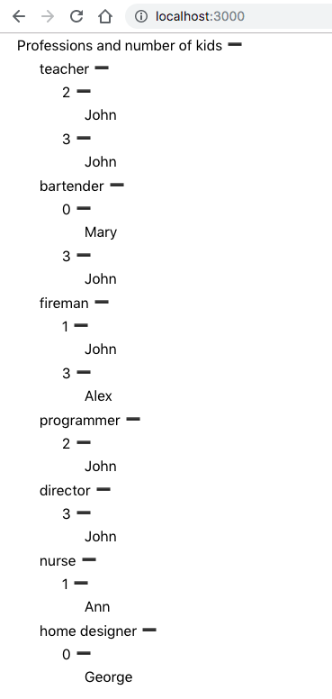
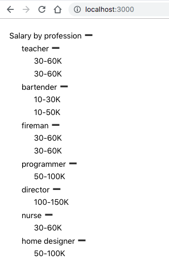
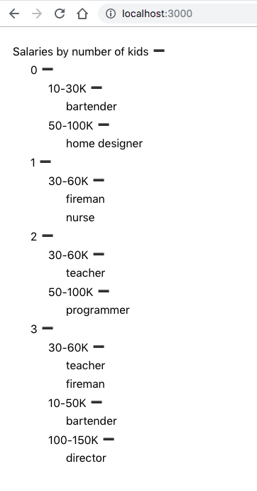

# Project overview

A hobby project for playing around with:

- ✅ React Hooks
- ✅ Styled-Components
- ✅ Redux and React-Redux
- ✅ Typescript
- 👉 Hierarchical data rendering with `TreeList` component (more on this below)

See the [demo](http://glib-giraffe.surge.sh/) 🚀

For quickstart and available scripts please visit _Create React App_ section below

## More in-depth description

The goal of the project was the following

A) for a list:

- containing objects
- all being identical - having some attributes (i.e. flat, tabular data),
- serialized as JSON array

B) write a SPA, that:

- uses `Redux` for
  - loading the JSON array asynchronously via HTTP/HTTPS
  - converting it to internal representation
  - storing
  - orchestrating unidirectional data-flow
- and, finally, visualizes the data (having attributes as a hierarchy)

The last goal is achieved by `TreeList` component, written completely from scratch, equipped with **convenient** transforming a flat list of rows into any given hierarchy.

### Visualizing hierarchical data with `TreeList` component

As an example, in the following JSON:

```
[
  {
    "name": "John",
    "occupation": "teacher",
    "salary": "30-60K",
    "children": "3"
  },
  {
    "name": "Mary",
    "occupation": "bartender",
    "salary": "10-30K",
    "children": "0"
  },
  {
    "name": "John",
    "occupation": "teacher",
    "salary": "30-60K",
    "children": "2"
  },
  {
    "name": "John",
    "occupation": "bartender",
    "salary": "10-50K",
    "children": "3"
  },
  {
    "name": "John",
    "occupation": "fireman",
    "salary": "30-60K",
    "children": "1"
  },
  {
    "name": "Alex",
    "occupation": "fireman",
    "salary": "30-60K",
    "children": "3"
  },
  {
    "name": "John",
    "occupation": "programmer",
    "salary": "50-100K",
    "children": "2"
  },
  {
    "name": "John",
    "occupation": "director",
    "salary": "100-150K",
    "children": "3"
  },
  {
    "name": "Ann",
    "occupation": "nurse",
    "salary": "30-60K",
    "children": "1"
  }
]
```

as everyone can clearly see, there are four attributes:

- `occupation`
- `salary`
- `children`
- `name` (not very useful)

that might be visualized differently (allowing for different data drill down scenarios):







The latest visualization can be achieved by the following conversion call

```
const raw = [
  {
    "name": "John",
    "occupation": "teacher",
    "salary": "30-60K",
    "children": "3"
  },
  // ...
]

const node = convertRawDataToTreeNodeWithHierarchy<SalaryInformationRecord>(
  raw,
  ["children", "salary", "occupation"],
  "Salaries by number of kids"
)
```

where `SalaryInformationRecord` is a Typescript interface matching a single **record** in the presented JSON array **table**:

```
interface SalaryInformationRecord {
  name: string
  occupation: string
  salary: string
  children: string
}
```

As you can see, the `TreeView` itself takes care of converting flat, tabular data into a (desired) tree hierarchy. So, component not only takes care of presenting data, but also provides some helper modules/functions for transforming data (which in this case is highly relevant)

## Project (implementation and design) decisions

- ✅ Create React App with Typescript support was used as a quick kick-start
- ✅ Redux-related file organization and general ideas are based on the [following guidelines](https://github.com/sharpcoding/react-redux-typescript-starter-kit)
- ✅ Screens and components exhibit **batteries-included** approach:
  - a screen contains reducers, actions, action creators, effects, models etc. that are relevant to getting things done - it is up to Redux store to take it and aggregate / reuse accordingly
  - similarly, a component contains models and algorithms that are relevant to component responsibility
- ✅ Components and modules are being kept very small and tidy
- ✅ "Batteries included" approach is complementary to code-reuse: if something can in (re)used by several places of application, it should be moved up to a dedicated module; please note this demo-project is extremely small
- ✅ `index.ts`/`index.tsx` is used very heavily to re-export entities as folders are grouping bigger functionalities and act as modules
  - e.g. [data structures](/src/components/TreeList/data-structures/index.ts) re-exports [TreeNode](/src/components/TreeList/data-structures/tree-node.ts) interface, then [TreeList](/src/components/TreeList/index.tsx) component re-exports everything that can be considered as `TreeList` public interface (data structures and `TreeNode` as the result)
- ✅ Emoji characters, not the SVG icons were used for rendering expand / collapse buttons (simpler, faster)
- ✅ Styled-Components
  - are placed in separate modules named `styles`
  - are imported the following way: `import * as S from './styles'`
- ✅ React function components (with hooks) are preferred over class components
- ✅ Named exports/imports are preferred over `default`
- ✅ [Prettier](https://github.com/prettier/prettier) formatter was chosen to keep code tidy

# Create React App section

This project was bootstrapped with [Create React App](https://github.com/facebook/create-react-app).

## Available Scripts

In the project directory, you can run:

### `npm start`

Runs the app in the development mode.<br>
Open [http://localhost:3000](http://localhost:3000) to view it in the browser.

The page will reload if you make edits.<br>
You will also see any lint errors in the console.

### `npm test`

Launches the test runner in the interactive watch mode.<br>
See the section about [running tests](https://facebook.github.io/create-react-app/docs/running-tests) for more information.

### `npm run build`

Builds the app for production to the `build` folder.<br>
It correctly bundles React in production mode and optimizes the build for the best performance.

The build is minified and the filenames include the hashes.<br>
Your app is ready to be deployed!

See the section about [deployment](https://facebook.github.io/create-react-app/docs/deployment) for more information.

### `npm run eject`

**Note: this is a one-way operation. Once you `eject`, you can’t go back!**

If you aren’t satisfied with the build tool and configuration choices, you can `eject` at any time. This command will remove the single build dependency from your project.

Instead, it will copy all the configuration files and the transitive dependencies (Webpack, Babel, ESLint, etc) right into your project so you have full control over them. All of the commands except `eject` will still work, but they will point to the copied scripts so you can tweak them. At this point you’re on your own.

You don’t have to ever use `eject`. The curated feature set is suitable for small and middle deployments, and you shouldn’t feel obligated to use this feature. However we understand that this tool wouldn’t be useful if you couldn’t customize it when you are ready for it.

```

```
